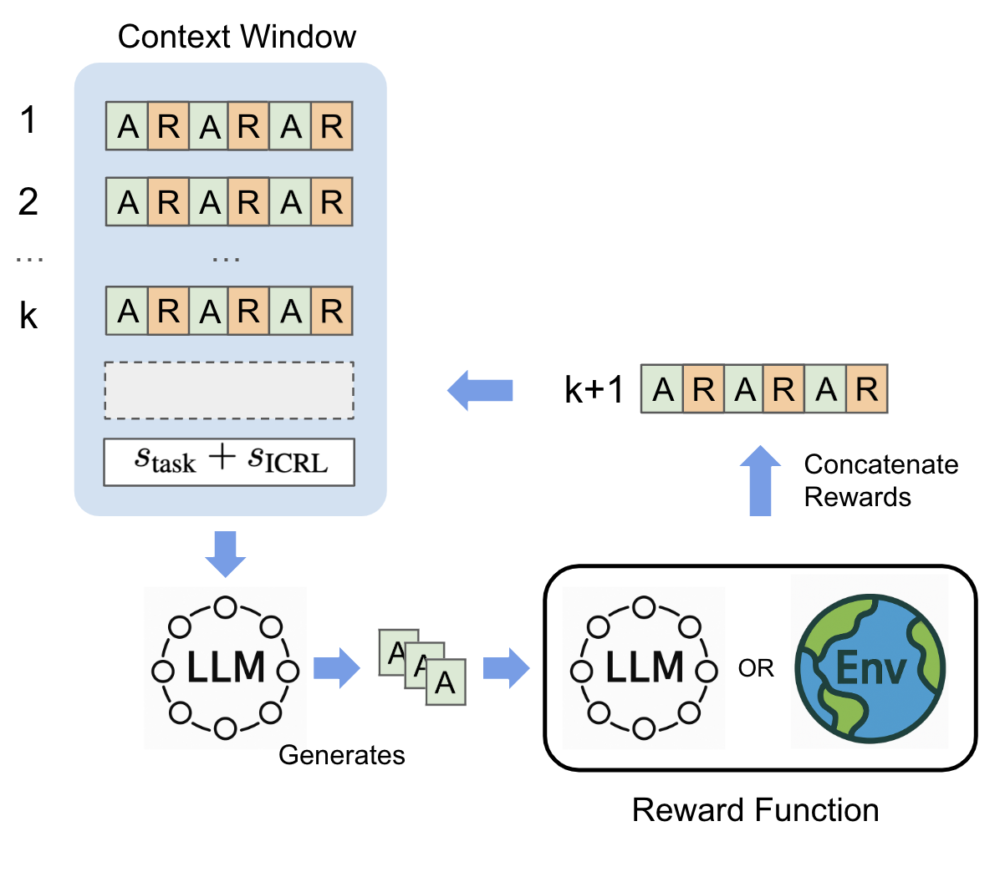

# Reward Is Enough: LLMs Are In-Context Reinforcement Learners

[](https://arxiv.org/abs/2506.06303)
[](https://iclr.cc/virtual/2026/poster/10007762)

This repository contains the code for reproducing the results in the paper "Reward Is Enough: LLMs Are In-Context Reinforcement Learners" (ICLR 2026).

<p align="center">
  
</p>

## Repository Structure

```
├── experiments/                          # Core ICRL experiments
│   ├── game24/                           # Game of 24
│   ├── creative_writing/                 # Creative Writing
│   ├── math/                             # Math Competitions (AIME/HMMT)
│   └── sciworld/                         # ScienceWorld
├── analysis/                             # Analysis experiments & visualization
│   ├── attention_analysis/               # Reward-sensitive attention heads
│   ├── beyond_parametric_knowledge/      # ArXiv abstract generation
│   └── data_analysis/                    # Plotting & post-processing
├── requirements/                         # Dependencies
│   ├── requirements_sciworld_math.txt    # ScienceWorld & Math experiments
│   └── requirements_creative_writing_game24.txt  # Creative Writing & Game of 24
└── README.md
```

## Shared Setup

Install the dependencies. We recommend using `uv`.

For ScienceWorld and Math experiments:
```bash
uv venv --python 3.11
source .venv/bin/activate
uv pip install -r requirements/requirements_sciworld_math.txt
```

For Creative Writing and Game of 24 experiments:
```bash
uv pip install -r requirements/requirements_creative_writing_game24.txt
```

## Game of 24

Configure the OpenAI API key and specify which ICRL method or ablation to run in the file, then run:
```bash
cd experiments/game24
python llm_game24_api.py
```

Run reflexion baseline:
```bash
python llm_game24_api_reflexion.py
```
Run self-refine baseline:
```bash
python llm_game24_api_self-refine.py
```
Run Best-of-N baseline:
```bash
python llm_game24_api_rejection.py
```
Run long CoT baseline:
```bash
python llm_game24_api_CoT.py
```


## Creative Writing

Configure the OpenAI API key and specify which ICRL method or ablation to run in the file, then run:
```bash
cd experiments/creative_writing
python llm_creative_writing_api.py
```

Run reflexion baseline:
```bash
python llm_creative_writing_api_reflexion.py
```
Run self-refine baseline:
```bash
python llm_creative_writing_api_self-refine.py
```
Run long CoT baseline:
```bash
python llm_creative_writing_api_CoT.py
```

## ScienceWorld

### Setup

Make sure you have Java 1.8+ installed
```bash
javac -version
```

Clone the ScienceWorld repository and install it
```bash
git clone https://github.com/allenai/ScienceWorld.git
cd ScienceWorld
pip install -e .
```

### Running the experiments

```bash
cd experiments/sciworld
```

Run ICRL preset:
```bash
python3 sciworld.py icrl_mode=ICRL num_envs=29
```

Run ICRL ablations, e.g. explore_only:
```bash
python3 sciworld.py icrl_mode=ICRL num_envs=29 explore_only=true
```

Run other baselines, e.g. random sampling:
```bash
python3 sciworld.py icrl_mode=RANDOM_SAMPLING num_envs=29 max_env_steps=200
```

For all the other options available including the ablations and baselines, refer to the `SciWorldConfig` class in `experiments/sciworld/sciworld.py`.

## Math Competitions (AIME/HMMT)

```bash
cd experiments/math
python math_bench.py
```

## Beyond Parametric Knowledge (ArXiv Abstract Generation)

```bash
cd analysis/beyond_parametric_knowledge
```

Run ICRL:
```bash
python beyond_parametric_knowledge.py
```

Run Best-of-N baseline:
```bash
python beyond_parametric_knowledge.py --rejection_sampling
```

Run exploitation-only ablation:
```bash
python beyond_parametric_knowledge.py --exploitation_only
```

Run exploration-only ablation:
```bash
python beyond_parametric_knowledge.py --explore_only
```

## Attention Analysis (Reward-Sensitive Heads)

Analyzes attention patterns in Qwen3-32B to identify reward-sensitive heads. Requires 2 GPUs.

```bash
cd analysis/attention_analysis
```

Run the initial analysis (layers -1 to -4, 64 heads each):
```bash
bash test_layers_heads.sh <path_to_output_list.json>
```

Run the extended analysis across all 32 layers:
```bash
bash run_all_layers.sh <path_to_output_list.json>
```

Generate the significant heads figure:
```bash
python plot_significant_heads_bar.py
```

> Acknowledgement:
> We have borrowed code from the [ScienceWorld](https://github.com/allenai/ScienceWorld), [ARMAP](https://github.com/heaplax/ARMAP), and [CLIN](https://github.com/allenai/clin) repositories.

## Citation

```bibtex
@inproceedings{song2026reward,
      title={Reward Is Enough: LLMs Are In-Context Reinforcement Learners}, 
      author={Kefan Song and Amir Moeini and Peng Wang and Lei Gong and Rohan Chandra and Shangtong Zhang and Yanjun Qi},
      booktitle={International Conference on Learning Representations (ICLR)},
      year={2026},
      eprint={2506.06303},
      archivePrefix={arXiv},
      primaryClass={cs.LG},
      url={https://arxiv.org/abs/2506.06303}, 
}
```
